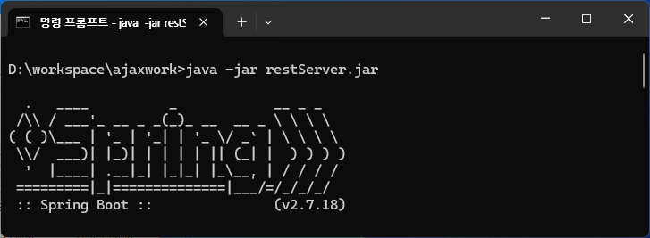
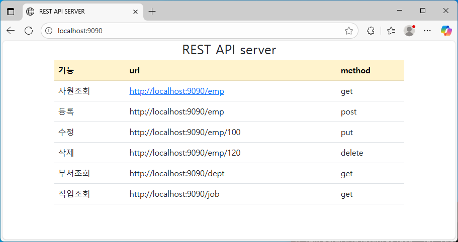
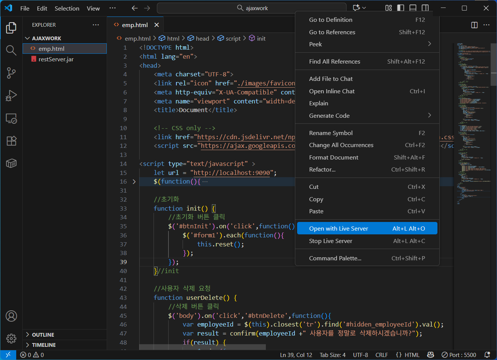
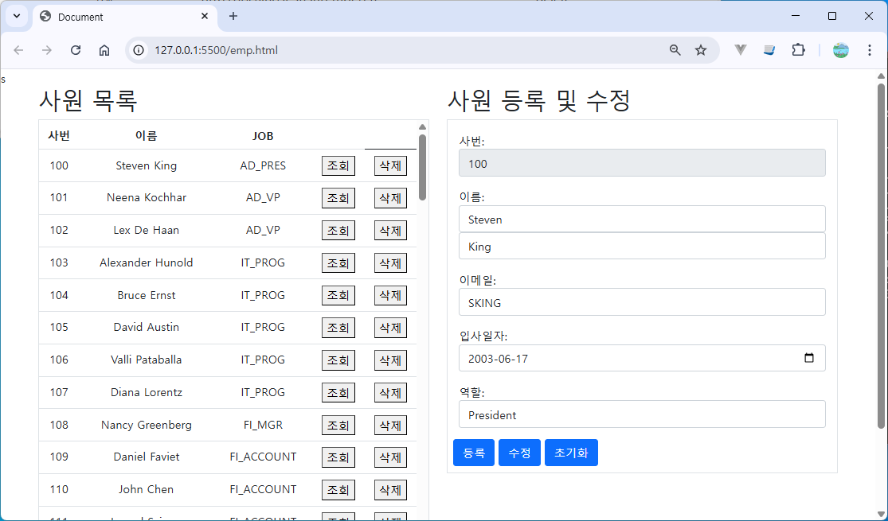

# AJAX 실습

## 서버 구동하기
```sh
java -jar restServer.jar
```
데이터베이스 계정 패스워드가 다르다면
```sh
java -jar -Dspring.datasource.password=hr restServer.jar
```
  

## 서버 테스트
```sh
http://localhost:9090
```


## 클라이언트 구동하기
emp.html 파일을 `Open with live server`로 실행  
  
브라우저 테스트
  